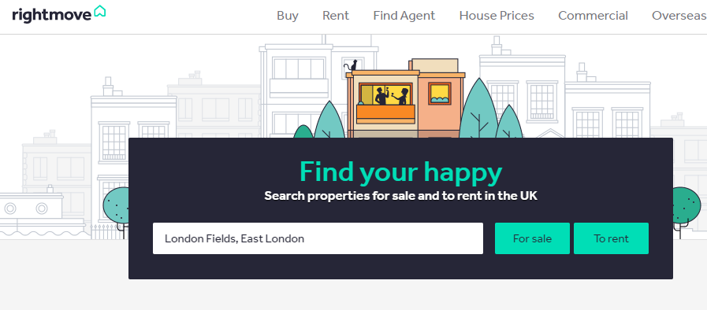

# AuctionsWebCrawler
Web Crawlers for real estate auctions and data analysis.  


# rightmove-webscraper

[](https://pepy.tech/project/rightmove-webscraper)

<a href="http://www.rightmove.co.uk/" target="_blank">rightmove.co.uk</a> is one of the UK's largest property listings websites, hosting thousands of listings of properties for sale and to rent.

<code>rightmove_webscraper.py</code> is a simple Python interface to scrape property listings from the website and prepare them in a Pandas dataframe for analysis.

## Installation

Version 1.1 is available to install via Pip:

 <code>pip install -U rightmove-webscraper</code>

## Scraping property listings

1) Go to <a href="http://www.rightmove.co.uk/">rightmove.co.uk</a> and search for whatever region, postcode, city, etc. you are interested in. You can also add any additional filters, e.g. property type, price, number of bedrooms, etc.



2) Run the search on the rightmove website and copy the URL of the first results page.

3) Create an instance of the class with the URL as the init argument.

```python
from rightmove_webscraper import RightmoveData

url = "https://www.rightmove.co.uk/property-for-sale/find.html?searchType=SALE&locationIdentifier=REGION%5E94346"
rm = RightmoveData(url)
```

## What will be scraped?

When a `RightmoveData` instance is created it automatically scrapes every page of results available from the search URL. However please note that rightmove restricts the total possible number of results pages to 42. Therefore if you perform a search which could theoretically return many thousands of results (e.g. "all rental properties in London"), in practice you are limited to only scraping the first 1050 results (42 pages * 25 listings per page = 1050 total listings). A couple of suggested workarounds to this limitation are:

* Reduce the search area and perform multiple scrapes, e.g. perform a search for each London borough instead of 1 search for all of London.
* Add a search filter to shorten the timeframe in which listings were posted, e.g. search for all listings posted in the past 24 hours, and schedule the scrape to run daily.

Finally, note that not every piece of data listed on the rightmove website is scraped, instead it is just a subset of the most useful features, such as price, address, number of bedrooms, listing agent. If there are additional data items you think should be scraped, please submit an issue or even better go find the xml path and submit a pull request with the changes.

## Accessing data 

The following instance methods and properties are available to access the scraped data.

**Full results as a Pandas.DataFrame**

```python
rm.get_results.head()
```

<table border="1" class="dataframe">  <thead>    <tr style="text-align: right;">      <th></th>      <th>price</th>      <th>type</th>      <th>address</th>      <th>url</th>      <th>agent_url</th>      <th>postcode</th>      <th>full_postcode</th>      <th>number_bedrooms</th>      <th>search_date</th>    </tr>  </thead>  <tbody>    <tr>      <th>0</th>      <td>3400000.0</td>      <td>2 bedroom apartment for sale</td>      <td>Switch House East, Battersea Power Station, SW11</td>      <td>http://www.rightmove.co.uk/properties/121457195#/?channel=RES_BUY</td>      <td>http://www.rightmove.co.uk/estate-agents/agent/JLL/London-Residential-Developments-100183.html</td>      <td>SW11</td>      <td>NaN</td>      <td>2.0</td>      <td>2022-03-24 09:40:13.769706</td>    </tr>    <tr>      <th>1</th>      <td>11080000.0</td>      <td>Property for sale</td>      <td>Battersea Power Station, Circus Road East, London</td>      <td>http://www.rightmove.co.uk/properties/118473812#/?channel=RES_BUY</td>      <td>http://www.rightmove.co.uk/estate-agents/agent/Moveli/London-191324.html</td>      <td>NaN</td>      <td>NaN</td>      <td>NaN</td>      <td>2022-03-24 09:40:13.769706</td>    </tr>    <tr>      <th>2</th>      <td>9950000.0</td>      <td>5 bedroom apartment for sale</td>      <td>888 Scott House, Battersea Power Station, SW11</td>      <td>http://www.rightmove.co.uk/properties/89344718#/?channel=RES_BUY</td>      <td>http://www.rightmove.co.uk/estate-agents/agent/Prestigious-Property-Ltd/Ruislip-67965.html</td>      <td>SW11</td>      <td>NaN</td>      <td>5.0</td>      <td>2022-03-24 09:40:13.769706</td>    </tr>    <tr>      <th>3</th>      <td>9200000.0</td>      <td>3 bedroom penthouse for sale</td>      <td>Battersea Power Station, Nine Elms, London SW8</td>      <td>http://www.rightmove.co.uk/properties/114236963#/?channel=RES_BUY</td>      <td>http://www.rightmove.co.uk/estate-agents/agent/Copperstones/London-82091.html</td>      <td>SW8</td>      <td>NaN</td>      <td>3.0</td>      <td>2022-03-24 09:40:13.769706</td>    </tr>    <tr>      <th>4</th>      <td>9000000.0</td>      <td>6 bedroom apartment for sale</td>      <td>Scott House, Battersea Power Station, SW11</td>      <td>http://www.rightmove.co.uk/properties/107110697#/?channel=RES_BUY</td>      <td>http://www.rightmove.co.uk/estate-agents/agent/Dockleys/London-174305.html</td>      <td>SW11</td>      <td>NaN</td>      <td>6.0</td>      <td>2022-03-24 09:40:13.769706</td>    </tr>  </tbody></table>


**Average price of all listings scraped**

```python
rm.average_price
```

> `1650065.841025641`

**Total number of listings scraped**

```python
rm.results_count
```

> `195`

**Summary statistics** 

By default shows the number of listings and average price grouped by the number of bedrooms:

```python
rm.summary()
```

<table border="1" class="dataframe">  <thead>    <tr style="text-align: right;">      <th></th>      <th>number_bedrooms</th>      <th>count</th>      <th>mean</th>    </tr>  </thead>  <tbody>    <tr>      <th>0</th>      <td>0</td>      <td>39</td>      <td>9.119231e+05</td>    </tr>    <tr>      <th>1</th>      <td>1</td>      <td>46</td>      <td>1.012935e+06</td>    </tr>    <tr>      <th>2</th>      <td>2</td>      <td>88</td>      <td>1.654237e+06</td>    </tr>    <tr>      <th>3</th>      <td>3</td>      <td>15</td>      <td>3.870867e+06</td>    </tr>    <tr>      <th>4</th>      <td>4</td>      <td>2</td>      <td>2.968500e+06</td>    </tr>    <tr>      <th>5</th>      <td>5</td>      <td>1</td>      <td>9.950000e+06</td>    </tr>    <tr>      <th>6</th>      <td>6</td>      <td>1</td>      <td>9.000000e+06</td>    </tr>  </tbody></table>

Alternatively group the results by any other column from the <code>.get_results</code> DataFrame, for example by postcode:

```python
rm.summary(by="postcode")
```

<table border="1" class="dataframe">  <thead>    <tr style="text-align: right;">      <th></th>      <th>postcode</th>      <th>count</th>      <th>mean</th>    </tr>  </thead>  <tbody>    <tr>      <th>0</th>      <td>SW11</td>      <td>76</td>      <td>1.598841e+06</td>    </tr>    <tr>      <th>1</th>      <td>SW8</td>      <td>28</td>      <td>2.171357e+06</td>    </tr>  </tbody></table>

## Legal

<a href="https://github.com/toddy86">@toddy86</a> has pointed out per the terms and conditions <a href="https://www.rightmove.co.uk/this-site/terms-of-use.html"> here</a> the use of webscrapers is unauthorised by rightmove. So please don't use this package!


# Install Requirements

A requirements file has been added to be able to install the required libraries. To install them, you need to run:

```bash
pip install -r requirements
```

Search on GitHub for https://github.com/Real-Estate-Scrapy?language=python:

1. Atico       https://github.com/Real-Estate-Scrapy/atico.git
1. Dedomeno    https://github.com/ginopalazzo/dedomeno.git
1. Fotocasa    https://github.com/Real-Estate-Scrapy/fotocasa.git
1. Habitaclia  https://github.com/Real-Estate-Scrapy/habitaclia.git
1. Housell     https://github.com/Real-Estate-Scrapy/housell.git
1. Housfly     https://github.com/Real-Estate-Scrapy/housfy.git
1. Kasaz       https://github.com/Real-Estate-Scrapy/kasaz.git
1. Pisocasas   https://github.com/Real-Estate-Scrapy/pisocasas.git
1. Pisos       https://github.com/Real-Estate-Scrapy/pisos.git
1. scraping-real-estate-websites https://github.com/dmpe/scraping-real-estate-websites.git
1. Tucasa      https://github.com/Real-Estate-Scrapy/tucasa.com.git

It should also include
1. real-estate-scrapers https://github.com/tuw-eeg/real-estate-scrapers.git.

It takes advantage of Scrapy to scrape data from the web, in combination with web-poet and scrapy-poet to decouple the scraping logic (the HTML structure of different real estate websites) abd the spider logic (the logic to collect the data).


**Other requirements**
- Mozilla
- geckodriver.exe, to be placed in PATH (e.g. C:\Users\feder\Anaconda3)

# Data sources 
| Website                                                | Comments                                                                      | Search URL                                                                                                                                                                                             |
|--------------------------------------------------------|-------------------------------------------------------------------------------|--------------------------------------------------------------------------------------------------------------------------------------------------------------------------------------------------------|
| https://annunci.repubblica.it/italia/immobiliare/      |                                                  | https://annunci.repubblica.it/italia/immobiliare/                                                                                                                                                      |
| https://aste.immobiliare.it/                           |                                                  | https://aste.immobiliare.it/ricerca-generale/provincia-PA/categoria-1?pag=2                                                                                                                            |
| https://aste.iqera.it/index_A.jsp                      |                                                  | https://aste.iqera.it/public/estate/ricerca_A.jsp?aType=search.are&txtRicercaRegione_COMBO=SIC&txtRicercaProvincia_COMBO=PA&txtRicercaComuni_COMBO=&txtImmTipo_COMBO=RESIDENZIALE&txtImmSupDa=&fs=true |
| https://blinksre.prelios.com/                          |                                       |                                                                                                                                                                                                        |
| https://immobiliare.guber.it/Home                      |                                       |                                                                                                                                                                                                        |
| https://pvp.giustizia.it/pvp/it/homepage.page          |  |                                                                                                                                                                                                        |
| https://resales.intrum.it/                             |                                       |                                                                                                                                                                                                        |
| https://venditepubblichenotarili.notariato.it          |                                                  |                                                                                                                                                                                                        |
| https://www.astainsieme.it                             |                                                  |                                                                                                                                                                                                        |
| https://www.astalegale.net/                            |                                       | No                                                                                                                                                                                                     |
| https://www.astagiudiziaria.com/                       |                                       | No                                                                                                                                                                                                     |
| https://www.asteavvisi.it/                             |                                                  |                                                                                                                                                                                                        |
| https://www.astegiudiziarie.it                         |                                       | No                                                                                                                                                                                                     |
| https://www.asteimmobili.it/                           |                                                  |                                                                                                                                                                                                        |
| https://www.asteravenna.eu/                            |                                                  |                                                                                                                                                                                                        |
| https://www.astetelematiche.it/                        |                                                  |                                                                                                                                                                                                        |
| https://www.avvisinotarili.notariato.it/               |                                                  |                                                                                                                                                                                                        |
| https://www.canaleaste.it/                             |                                                  |                                                                                                                                                                                                        |
| https://www.casa.it/                                   |                                                  |                                                                                                                                                                                                        |
| https://www.entietribunali.it                          |                                                  |                                                                                                                                                                                                        |
| https://www.fallcoaste.it                              |                                                  |                                                                                                                                                                                                        |
| https://www.idealista.it/                              |                                       |                                                                                                                                                                                                        |
| https://www.immobiliallasta.it/                        |                                                  |                                                                                                                                                                                                        |
| https://www.immobiliare.it/                            |                                       |                                                                                                                                                                                                        |
| https://www.intribunale.net/                           |                                                  |                                                                                                                                                                                                        |
| http://www.legalmente.net                              |                                                  |                                                                                                                                                                                                        |
| https://www.portaleaste.com                            |                                                  | No                                                                                                                                                                                                     |
| https://www.quimmo.it/                                 |                                                  |                                                                                                                                                                                                        |
| https://www.rivistaastegiudiziarie.it/                 |                                                  |                                                                                                                                                                                                        |
| https://www.spazioaste.it/Immobili/Search              |                                                  | No                                                                                                                                                                                                     |
| https://www.subito.it/annunci-italia/vendita/immobili/ |                                                  |                                                                                                                                                                                                        |
| https://www.tribunale.laspezia.it/                     |                                                  |                                                                                                                                                                                                        |
| https://www.tribunale.savona.giustizia.it/             |                                                  |                                                                                                                                                                                                        |
| http://www.trovoaste.it/                               |                                                  |                                                                                                                                                                                                        |
| http://www.trovocasa.corriere.it/                      |                                                  |                                                                                                                                                                                                        |


# Todo List & Progress monitoring

- [ ] Add sources ---> 15%
  - [ ] https://www.astegiudiziarie.it  --->               0%
  - [ ] https://www.astalegale.net/  --->                  80% 
  - [ ] https://www.realestatediscount.com/ --->           0%
  - [ ] https://www.asterealestate.it/index_A.jsp --->     0% 
  - [ ] https://pvp.giustizia.it/pvp/it/homepage.page ---> 0%  
- [ ] Harmonise filter parameters when using multiple sources ---> 0%
- [ ] Harmonise output column structure when using multiple sources ---> 0%
- [ ] Data Cleaning ---> 0%
  - [ ] standardisation of categorical variables --->               0%
  - [ ] standardisation of numerical formatting / encoding --->               0%
- [ ] Data Analysis ---> 0%
- [ ] Output Visualizazion ---> 0%


1. https://www.google.com/search?q=crescita+demografica+comuni+italia&oq=crescita+demografica+comuni+italia&aqs=chrome..69i57j33i10i160l2j33i22i29i30l6j33i15i22i29i30.10762j0j7&sourceid=chrome&ie=UTF-8
1. https://ugeo.urbistat.com/AdminStat/it/it/classifiche/dati-sintesi/province/italia/380/1
1. https://it.wikipedia.org/wiki/Demografia_d%27Italia
1. https://demo.istat.it/popres/download.php?anno=2022&lingua=ita


This is a Right Move House Scraper that was built over a few hours in a weekend and we used to look for a property.
It will scrape Right Move every night, save data in Neo4J and then send an e-mail out with the latest viable properties, pictures, price, description, distance to station and a link back to Rightmove.
I wrote the code as I was interested in creating an entire system using [Celery](http://www.celeryproject.org/), [RabbitMQ](https://www.rabbitmq.com/) and [Neo4J](https://neo4j.com). The scraper uses Gmail.
It scrapes London Stations every night and then sends an e-mail based on pre-defined parameters:
- minimum and maximum price and minimum number of bedrooms (rightmovescraper.py)
- help to buy - one of these words are mentioned: help_to_buy_filters = ['new', 'luxury', 'help']
To set up (sorry, did not consider multiple users at the time):
- add the e-mail account to send e-mails from by editing gmail_mail_sender.py.
- modify error@error_email.com in ./celery_worker/scraper_tasks/tasks.py to add the email of the admin
- modify the hostname in bash/server_docker_cmds.sh from hostname.for.rabbitmq to something you want
- modify [get_station_based_initial_search_urls](rightmove_scraper.py) with your property parameters.
To build the images do: ./bash/docker_compose_build.sh
To run it do: ./bash/docker_compose_start
To stop it do: ./bash/docker_compose_stop
If you want to do a quick test edit manually_scrape.py and change your e-mail address.


# [rightmove-scraper](https://github.com/whoiskatrin/rightmove-scraper)


rightmove.co.uk is one of the UK's largest property listings websites, hosting thousands of listings of properties for sale and to rent.
rightmove.py is a simple Python interface to scrape property listings to buy or rent from the website and prepare them in a Pandas dataframe with a possibility to email to desired recipient.

# [rightmove-scraper](https://github.com/vrambo8/rightmove-scraper)

# Rightmove-Price-Monitor
A web scraper to monitor price histories on Rightmove implemeted in Python.

crib
====
Crib is supposed to help me find a new place to rent by scraping property data
from websites like rightmove, zoopla etc and provide more advanced filters, and
functionality for finding the right crib. It is very opinionated and only meant
for my personal use.
Crib consists of 3 components:
- a scraper, which collects data and stores it in a database
- a server, that can serve that data back but with advanced filters
- a `web UI <https://github.com/storax/crib-web-ui>`_
Requirements
------------
- Python 3.7
- MongoDB
Installation
------------
The project only comes as source. Install it with your favorite python package
manager.
Usage
-----

MongoDB
+++++++
First set up a mongodb database. Here is an example ``mongod.yaml``
configuration::
  processManagement:
     fork: true
     pidFilePath: /tmp/mongodb.pid
  net:
     bindIp: localhost
     port: 27017
  storage:
     dbPath: /path/to/crib/db/
     journal:
        enabled: true
  systemLog:
     destination: file
     path: /path/to/log/file.log
     logAppend: true
Start mongodb::
  mongod --config mongod.yaml
Crib uses ``localhost:2717`` as default. The settings can be overridden in the config for crib::
  property_repository:
    type: MongoPropertyRepo
    connection:
      host: 'localhost:27017'
    database: "crib"
  
  user_repository:
    type: MongoUserRepo
    connection:
      host: 'localhost:27017'
    database: "crib"
  
  directions_repository:
    type: MongoDirectionsRepo
    connection:
      host: 'localhost:27017'
    database: "crib"
Scraping
++++++++
The scraper can be configured to scrape properties from rightmove search urls.
Here is an example ``config.yaml``::
  scrape:
    RIGHTMOVE_SEARCHES:
      - "https://www.rightmove.co.uk/property-to-rent/find.html?searchType=RENT&locationIdentifier=REGION%5E1498&insId=1&radius=0.0&minPrice=&maxPrice=&minBedrooms=&maxBedrooms=&displayPropertyType=&maxDaysSinceAdded=&sortByPriceDescending=&_includeLetAgreed=on&primaryDisplayPropertyType=&secondaryDisplayPropertyType=&oldDisplayPropertyType=&oldPrimaryDisplayPropertyType=&letType=&letFurnishType=&houseFlatShare="
Crib provides a ``crib`` CLI. You can scrape properties via::
  crib -c config.yaml scrape crawl rightmove
Crib comes with a default configuration for scrapy. You can override them in the
scrape section of the config. See the `scrapy documentation
<https://docs.scrapy.org/en/latest/topics/settings.html>`_ for available
settings.
List availabile spiders with::

  crib -c config.yaml scrape list

Google Directions Service
+++++++++++++++++++++++++
Crib can fetch the time it takes to your work to get commute times. You need an
`API KEY
<https://developers.google.com/maps/documentation/directions/get-api-key>`_ and
set it in the ``config.yaml``. You can also specify your place of work::
  directions_service:
    api-key: CHANGEME
    work-location:
      latitude: 51.0
      longitude: 0.0
  search-area:
    northEast:
      lat: 51.0
      lng: 0.05
    southWest:
      lat: 51.5
      lng: -0.3
    latsamples: 100
    lngsamples: 100
The search area command is used to scrape a grid of routes to ``work-location``.
Define the boundaries and samples in each direction and run::
  crib -c config.yaml server fetch-to-work
Setup user
++++++++++
No idea why you would need users in a personal project designed for a single
person, but I had fun trying to write a login page for the first time in my
life. So you need to register a user::

You might wanna override the default secrets for the srever. The server is a
simple flask application and settings can be specified in the ``server`` of the
config::
  server:
    JWT_SECRET_KEY: .......
    SECRET_KEY: ...
Next register a user via the CLI::
  crib -c config.yaml server add-user test
Start the backend
+++++++++++++++++
::
   crib -c config.yaml server run

